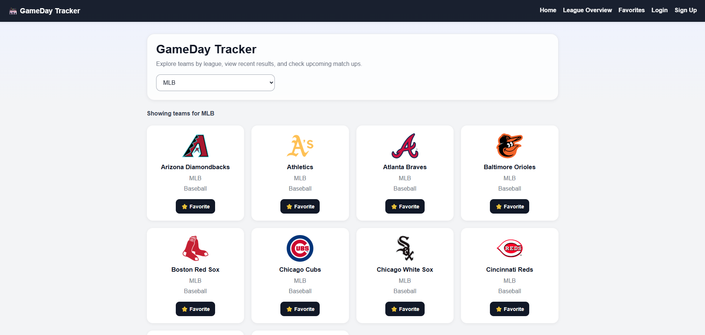
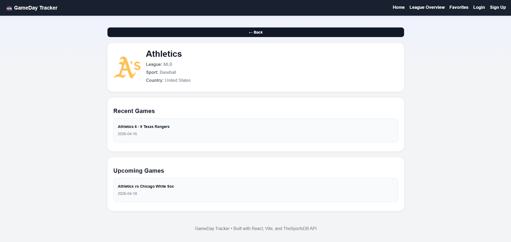
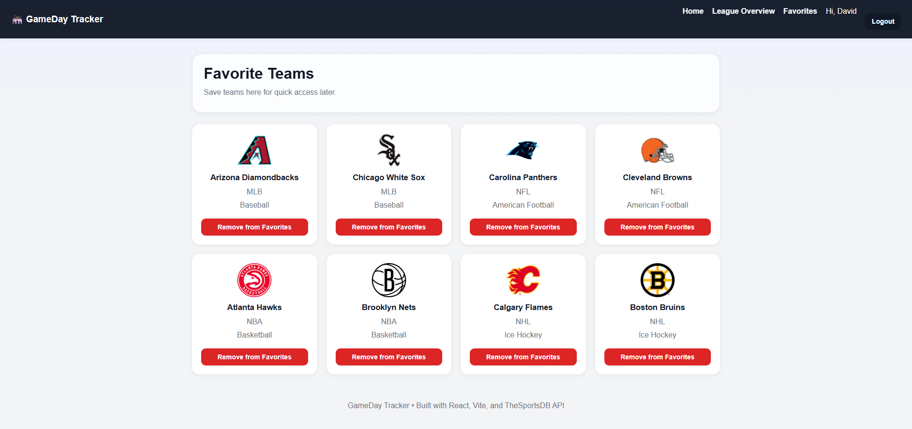

# 🏟️ GameDay Tracker

A responsive sports web application that allows users to explore teams, view game data, and save favorites — built with React and deployed on Vercel.

🔗 **Live App:** https://game-day-tracker.vercel.app/  
📦 **GitHub Repo:** https://github.com/DShinn96/GameDay-Tracker

---

## 🚀 Features

- 🔍 Browse teams by league (NBA, NFL, MLB, NHL)
- 📊 View team details, recent games, and upcoming matchups
- ⭐ Add and remove favorite teams
- 👤 Mock user authentication (login/signup)
- 💾 Favorites persist per user using localStorage
- 📱 Fully responsive design
- ⚡ Fast performance with Vite

---

## 🛠 Tech Stack

- **Frontend:** React
- **Routing:** React Router
- **Build Tool:** Vite
- **Styling:** CSS
- **API:** TheSportsDB
- **Deployment:** Vercel

---

## 🧠 How It Works

- Users can select a league and browse teams
- Clicking a team shows game data (recent + upcoming)
- Users can "log in" with a mock username system
- Favorites are stored locally per user using dynamic keys:

favorites\_{username}

---

## 📸 Screenshots


### Home Page



### Team Details



### Favorites Page



---

## 🧪 Local Development

```bash
git clone https://github.com/DShinn96/GameDay-Tracker.git
cd GameDay-Tracker
npm install
npm run dev
```
⚠️ Notes
● Authentication is mocked using localStorage (no real user data is stored)
● Some API endpoints may return limited data depending on availability

📌 Future Improvements
● Real authentication (Supabase or Firebase)
● Backend database for persistent storage
● Advanced team stats and standings
● Search functionality
● UI animations and loading states

🙌 Author

David Shinn
GitHub: https://github.com/DShinn96

⭐ If you like this project give it a star ⭐

